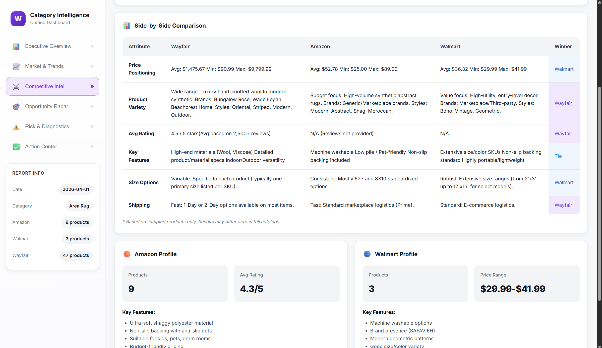

# Wayfair AI Automation Externship
This repository contains the work I completed for my 8-week experience with  Extern and Wayfair. This externship was focused on AI agents, automation, and marketing analytics.

### Project Breakdown
The externship was split into five projects:
1. __Moodboard Generator Agent__: Transforms simple ideas into concrete visuals
2. __Consumer Trend Discovery Agent__: Detects emerging design and product trends by scraping real-world data sources such as Amazon and design blogs
3. __Competitor Monitoring Agent__: Collects and analyzes competitor product listings, new launches, price movements and reviews to uncover what competitors are doing differently and what actionable insights Wayfair can make
4. __AI Insights & Content Generation Agent__: Transform trend and competitor data into create on-brand marketing ideas
5. __Intelligence Dashboard Agent__: Integrate all agents into a polished dashboard containing important insights and recommendations for Wayfair

### Tools & Tech Used
- __n8n__ (workflow automation platform)
- __APIs__ (Google OAuth2, Google Gemini, HuggingFace, Mistral AI)
- __JavaScript__ (web scraping, data cleaning)

### Final Output and Deliverables
- [Final Presentation PDF](docs/reports/FinalPresentation.pdf)
- [Last Generated Dashboard (4-1-26)](docs/reports/Area_rug_Dashboard.html)

### Areas For Future Improvement
There are several areas of focus that I believe will make this workflow much stronger:
- Expanding the system to ingest a higher volume of product URLs, social media posts, and design blogs to increase report accuracy and trend reliability
- Refining the AI prompts for more brand-aligned recommendations
- Extending the data sources byond marketplaces to social and influencer data
- Connecting consumer trends with Wayfair sales data by integratnig SKU performance metrics
